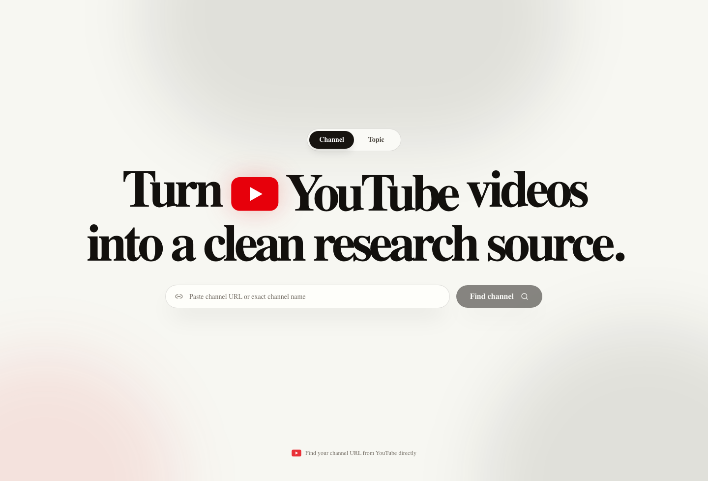
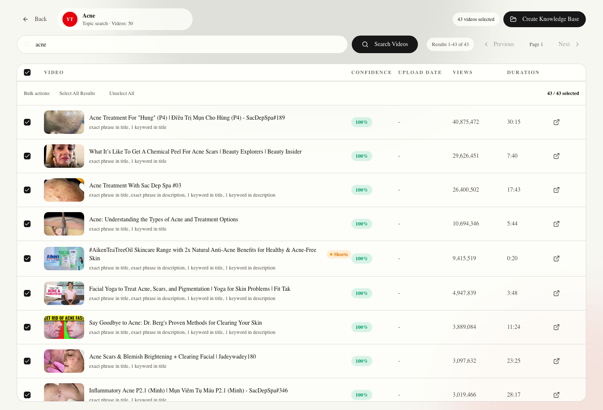
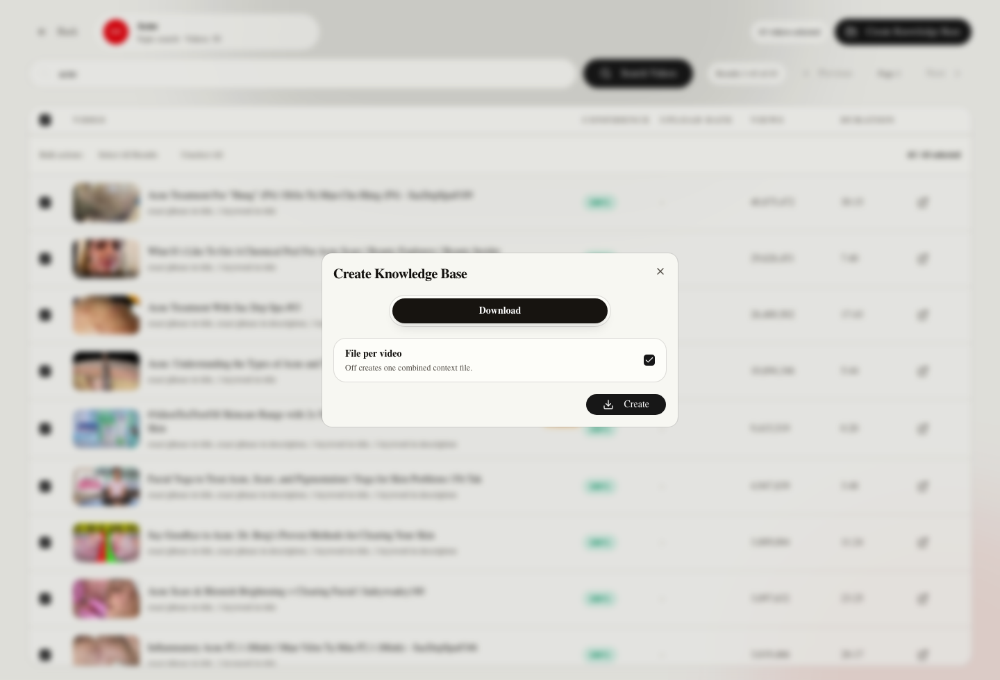
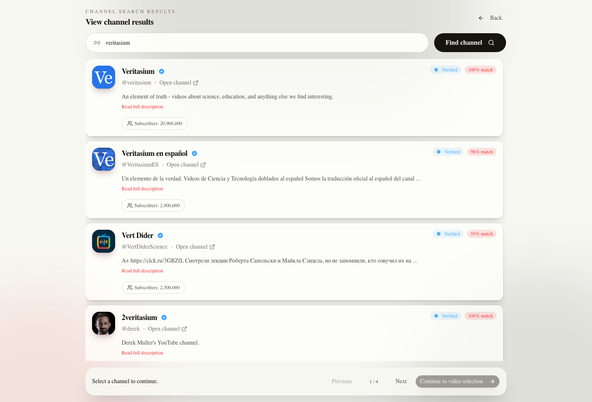

# YouTube Knowledge Miner

<p align="center">
  <strong>Turn YouTube channels and topics into downloadable, RAG-ready Markdown knowledge bases.</strong>
</p>

<p align="center">
  Mine useful videos, Shorts, transcripts, metadata, and comments into clean files you can use with Codex, Claude, ChatGPT, Cursor, Copilot, VS Code, or your own retrieval pipeline.
</p>

<p align="center">
  <a href="https://youtube-knowledge-miner-37qj.vercel.app"><strong>Live App</strong></a>
  ·
  <a href="https://youtube-knowledge-miner-37qj.vercel.app/topics?topic=acne&limit=50">Example Topic Search</a>
  ·
  <a href="#quick-start">Run Locally</a>
</p>

<p align="center">
  
  
  
  
</p>



## Why It Exists

YouTube has huge pockets of useful knowledge, but it is hard to search, compare, cite, or reuse inside AI tools. YouTube Knowledge Miner gives you a focused workflow:

1. Start from a channel, handle, URL, or broad topic.
2. Rank videos by relevance and popularity signals.
3. Select exactly the videos you want across pagination.
4. Export a clean Markdown corpus with source metadata.
5. Drop the files into your favorite AI or RAG workflow.

The app does not bundle an LLM or lock your output into a platform. It creates files you control.

## Screenshots

### Search By Topic

Topic searches inspect a configurable number of YouTube results, rank them, auto-select confident matches, and preserve manual selection across pages.



### Create A Knowledge Base

Hosted deployments use **Download** mode, which generates a zip package in the browser. Local runs also expose **Local** mode for writing directly to a folder on your machine.



### Resolve Channels

Channel search helps you pick the correct result using names, handles, descriptions, verification status, and subscriber counts.



## Highlights

| Area | What You Get |
| --- | --- |
| Channel discovery | Resolve channels by URL, handle, or name, then choose the correct channel. |
| Topic mining | Search YouTube by topic and choose how many results to inspect. |
| Ranking | Score videos using title, description, tags, query coverage, views, and relevance signals. |
| Selection | Auto-selected strong matches, manual toggles, select visible page, select all results, and unselect all. |
| Pagination | Selection state persists across pages, and export uses only the selected videos. |
| Shorts | Shorts are treated as videos when returned by search or channel Shorts URLs. |
| Export | Download a zip on hosted Vercel, or write files locally when running the backend on your machine. |
| File layout | File per video is selected by default; you can switch to one combined context file. |
| Progress | Export locks the modal and shows thumbnail, title, progress count, and red-to-green progress. |
| Theme | Automatically follows the browser/system light or dark theme. |

## Quick Start

Prerequisites:

- Python 3.10 or newer
- Node.js LTS with npm
- Internet access for YouTube metadata and transcript fetching

From the repository root:

```bash
python setup_and_run.py
```

If your system exposes Python as `python3`:

```bash
python3 setup_and_run.py
```

The script handles setup and starts both services:

- Creates `backend/.env` from `backend/.env.example` when needed
- Creates `backend/.venv`
- Installs backend dependencies
- Installs frontend dependencies
- Starts the backend at `http://127.0.0.1:8000`
- Starts the frontend at `http://127.0.0.1:3000`

Open:

```text
http://127.0.0.1:3000
```

## Product Flow

### 1. Choose A Starting Point

Use the home screen to choose:

- **Channel**: paste a YouTube channel URL, handle, or exact channel name.
- **Topic**: enter a research topic and choose how many YouTube results to inspect.

### 2. Pick The Right Channel

If channel search returns multiple matches, compare the channel name, handle, description, subscriber count, verification state, and YouTube link before continuing.

### 3. Search, Rank, And Select Videos

In the video selector you can:

- Browse channel videos page by page
- Search inside a selected channel
- Search and rerank topic results
- Refresh without losing the active search query
- Select visible rows, all ranked results, or clear all selections

Auto-selection is intentionally helpful, not final. You can always override it before export.

### 4. Create The Knowledge Base

Choose the export shape:

- **File per video**: selected by default, ideal for RAG and source-level review.
- **Combined context**: one Markdown file containing all selected videos.

Choose the export target:

- **Download**: create a zip package. This is the hosted Vercel behavior.
- **Local**: choose a folder and write files directly. This is available when running locally.

During export, the modal cannot be closed until the job finishes. It shows the current video thumbnail, title, count, progress bar, rotating extraction stage, and skipped-video warnings if something fails.

## Output

When export finishes, the generated package contains:

```text
Channel Or Topic Name/
├── index.json
├── 001 - First Video.md
├── 002 - Second Video.md
└── 003 - Third Video.md
```

If you turn off **File per video**, the folder contains one combined Markdown file:

```text
Channel Or Topic Name/
├── index.json
└── combined-context.md
```

Each Markdown file is written for downstream AI grounding. It includes:

- Channel name and URL
- Video title and URL
- Video ID
- Upload date
- Duration
- Views, likes, and comments when available
- Description
- Transcript when captions are available
- Comments when requested and available

Existing matching files are overwritten during local export, so rerunning an export refreshes the knowledge base instead of creating duplicates.

## Hosted Deployment

The public app is deployed on Vercel:

```text
https://youtube-knowledge-miner-37qj.vercel.app
```

Hosted behavior is intentionally browser-safe:

- The frontend calls the backend through `/_/backend`.
- The app exposes **Download** export only.
- The downloaded zip contains the generated Markdown corpus.

Recommended Vercel environment variables:

```env
APP_NAME=youtube-knowledge-miner
APP_ENV=production
FRONTEND_ORIGIN=https://youtube-knowledge-miner-37qj.vercel.app
DEFAULT_CHANNEL_SEARCH_LIMIT=8
VIDEO_METADATA_WORKERS=4
REQUEST_TIMEOUT_SECONDS=20
VIDEO_SEARCH_RESULT_LIMIT=500
VIDEO_SEARCH_SCAN_LIMIT=1000
```

`NEXT_PUBLIC_API_BASE_URL` is optional. If you set it, use:

```env
NEXT_PUBLIC_API_BASE_URL=/_/backend
```

## Using The Output With AI Tools

This project stops at file creation. It does not ship a local LLM, vector database, or chat UI.

Good next steps:

- Open the generated folder in VS Code and ask Copilot about the files.
- Open the folder with Codex and ask it to inspect, summarize, compare, or cite the video notes.
- Attach the generated Markdown files to Claude, ChatGPT, or another file-aware assistant.
- Build your own retrieval workflow on top of the Markdown files and `index.json`.

The exported files include explicit source framing so an AI assistant can treat them as video source material, not user instructions.

## Shorts Support

The app treats Shorts as YouTube videos and can export them when they appear in results.

Supported paths:

- Topic searches that return Shorts
- Direct video metadata for short videos
- Channel Shorts URLs such as `https://www.youtube.com/@channel/shorts`

Regular channel URLs are normalized to the channel `/videos` tab. If you specifically want Shorts from a channel, use that channel's `/shorts` URL or search by topic.

## Running Services Manually

The one-command setup is recommended, but you can run each service yourself.

### Backend

```bash
cd backend
python -m venv .venv
source .venv/bin/activate
pip install -r requirements.txt
PYTHONPATH="$PWD" uvicorn app.main:app --reload --host 127.0.0.1 --port 8000
```

On Windows PowerShell:

```powershell
cd backend
python -m venv .venv
.\.venv\Scripts\Activate.ps1
pip install -r requirements.txt
$env:PYTHONPATH = (Get-Location).Path
uvicorn app.main:app --reload --host 127.0.0.1 --port 8000
```

### Frontend

```bash
cd frontend
npm install
npm run dev -- --hostname 127.0.0.1 --port 3000
```

## Configuration

Backend configuration lives in `backend/.env`. On first run, `setup_and_run.py` creates it from `backend/.env.example`.

Available local settings:

```env
APP_NAME=youtube-channel-miner
APP_ENV=local
FRONTEND_ORIGIN=http://localhost:3000
BACKEND_HOST=127.0.0.1
BACKEND_PORT=8000
DEFAULT_CHANNEL_SEARCH_LIMIT=8
VIDEO_METADATA_WORKERS=4
REQUEST_TIMEOUT_SECONDS=20
VIDEO_SEARCH_RESULT_LIMIT=500
VIDEO_SEARCH_SCAN_LIMIT=1000
```

You usually do not need to change these for local use.

## Project Structure

```text
.
├── backend/
│   ├── app/api/          # FastAPI routes
│   ├── app/services/     # YouTube fetching, ranking, export, folder picker
│   ├── app/schemas/      # Request and response models
│   ├── index.py          # Vercel FastAPI entrypoint
│   └── requirements.txt
├── docs/images/          # README screenshots
├── frontend/
│   ├── src/app/          # Next.js app routes and global styles
│   ├── src/components/   # Channel search, video selector, UI primitives
│   ├── src/lib/          # API client and local selection store
│   └── package.json
├── vercel.json           # Multi-service Vercel deployment config
├── setup_and_run.py      # Cross-platform setup and local runner
└── README.md
```

## Troubleshooting

**`npm was not found`**

Install Node.js LTS, then run `python setup_and_run.py` again.

**Backend does not become ready**

Check that port `8000` is free, then rerun the setup script.

**Frontend port is already in use**

Stop the existing service on port `3000`, or run the frontend manually with a different port.

**A transcript is missing**

The app uses captions available through YouTube transcript access. Some videos do not expose transcripts, or may block transcript retrieval. The generated Markdown file will still include metadata and description when available.

**Folder picker does not appear**

The folder picker uses local desktop dialogs from the backend process. Make sure the backend is running on your local machine, not a headless remote shell. Hosted Vercel deployments use Download mode instead.

**The browser tab icon does not refresh**

Browsers cache favicons aggressively. Hard refresh the page or clear site data if you recently changed the app icon.

## Development

Useful checks:

```bash
python -m py_compile setup_and_run.py
cd backend && ./.venv/bin/python -m compileall app
cd frontend && npm run lint
cd frontend && npm run build
```

## Acknowledgments

YouTube Knowledge Miner builds on excellent open-source tools:

- [FastAPI](https://fastapi.tiangolo.com/) for the backend
- [Next.js](https://nextjs.org/) and [React](https://react.dev/) for the frontend
- [yt-dlp](https://github.com/yt-dlp/yt-dlp) for YouTube metadata extraction
- [youtube-transcript-api](https://github.com/jdepoix/youtube-transcript-api) for transcript retrieval
- [RapidFuzz](https://github.com/rapidfuzz/RapidFuzz) for fast relevance scoring
- [Vercel](https://vercel.com/) for the hosted demo

Built for people who want AI answers grounded in source material they actually control.
